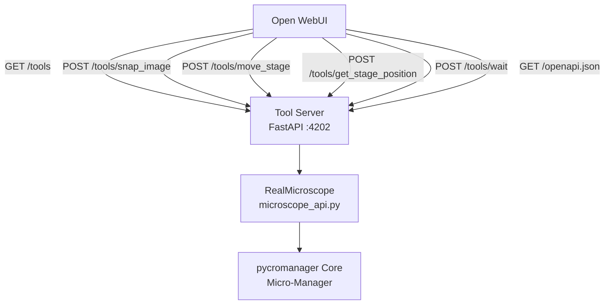

# Design Document: microscope-openwebui

## Overview

`microscope_openwebui` is a FastAPI-based HTTP server that wraps the same `RealMicroscope` backend used by `microscope_real`, but exposes microscope tools via the **Open WebUI external tools specification** instead of MCP. Open WebUI discovers tools by fetching a manifest from the server, then calls individual tool endpoints as plain HTTP POST requests with JSON bodies.

The module lives at `microscope_openwebui/` and is structured identically to `microscope_real/` — a `microscope_api.py` (copied/shared), a `server.py` (FastAPI app), and a `pyproject.toml`.

---

## Architecture



The server runs on port **4202** to avoid conflicts with the existing MCP servers (4200, 4201).

---

## Components and Interfaces

### `microscope_api.py`
Identical copy of `microscope_real/microscope_api.py`. Contains `RealMicroscope` with methods:
- `snap_image() -> dict`
- `move_stage(x, y, z) -> dict`
- `get_stage_position() -> dict`
- `wait(seconds) -> dict`
- `get_image_png() -> bytes`

### `server.py` — FastAPI application

**Endpoints:**

| Method | Path | Description |
|--------|------|-------------|
| GET | `/tools` | Returns Open WebUI tool manifest (JSON) |
| GET | `/openapi.json` | FastAPI auto-generated OpenAPI 3.x spec |
| POST | `/tools/snap_image` | Snap an image |
| POST | `/tools/move_stage` | Move stage to (x, y, z) |
| POST | `/tools/get_stage_position` | Get current stage position |
| POST | `/tools/wait` | Wait for N seconds |

**Open WebUI Tool Manifest format** (`GET /tools`):

```json
{
  "tools": [
    {
      "name": "snap_image",
      "description": "Capture an image from the microscope at the current stage position.",
      "parameters": {
        "type": "object",
        "properties": {},
        "required": []
      }
    },
    {
      "name": "move_stage",
      "description": "Move the microscope stage to the given (x, y, z) coordinates in µm.",
      "parameters": {
        "type": "object",
        "properties": {
          "x": {"type": "number", "description": "X coordinate in µm"},
          "y": {"type": "number", "description": "Y coordinate in µm"},
          "z": {"type": "number", "description": "Z coordinate in µm"}
        },
        "required": ["x", "y", "z"]
      }
    },
    {
      "name": "get_stage_position",
      "description": "Return the current stage position as {x, y, z}.",
      "parameters": {
        "type": "object",
        "properties": {},
        "required": []
      }
    },
    {
      "name": "wait",
      "description": "Pause execution for the given number of seconds.",
      "parameters": {
        "type": "object",
        "properties": {
          "seconds": {"type": "number", "description": "Duration to wait in seconds"}
        },
        "required": ["seconds"]
      }
    }
  ]
}
```

**Pydantic request/response models:**

```python
class MoveStageRequest(BaseModel):
    x: float
    y: float
    z: float

class WaitRequest(BaseModel):
    seconds: float

class ToolResponse(BaseModel):
    # varies per tool — returned as dict passthrough
    ...
```

**Error response shape:**
```json
{ "error": "<description>" }        // HTTP 500
{ "detail": "<validation message>" } // HTTP 422 (FastAPI default)
```

---

## Data Models

### Tool Manifest
```python
class ToolParameter(BaseModel):
    type: str
    properties: dict
    required: list[str]

class ToolEntry(BaseModel):
    name: str
    description: str
    parameters: ToolParameter

class ToolManifest(BaseModel):
    tools: list[ToolEntry]
```

### Stage Position (returned by move_stage / get_stage_position)
```python
{ "x": float, "y": float, "z": float }
```

### Snap Image Response
```python
{
  "status": "ok",
  "filename": str,
  "position": {"x": float, "y": float, "z": float},
  "image_path": str,
  "shape": list[int],
  "dtype": str
}
```

### Wait Response
```python
{ "status": "ok", "waited_seconds": float }
```

---

## Correctness Properties

*A property is a characteristic or behavior that should hold true across all valid executions of a system — essentially, a formal statement about what the system should do. Properties serve as the bridge between human-readable specifications and machine-verifiable correctness guarantees.*

---

**Property 1: Tool manifest completeness**
*For any* running Tool Server instance, a `GET /tools` request shall return a manifest containing entries for all four tools (`snap_image`, `move_stage`, `get_stage_position`, `wait`), each with a non-empty `name`, `description`, and `parameters` object.
**Validates: Requirements 1.1, 1.3**

---

**Property 2: JSON round-trip consistency**
*For any* JSON-serializable response produced by the Tool Server (manifest, OpenAPI doc, tool responses), serializing the object to a JSON string and then deserializing it shall produce an object equal to the original.
**Validates: Requirements 1.4, 6.2**

---

**Property 3: snap_image response structure**
*For any* successful `POST /tools/snap_image` call (with a mocked `RealMicroscope`), the response shall be HTTP 200 and the JSON body shall contain all six fields: `status`, `filename`, `position`, `image_path`, `shape`, and `dtype`, with `status == "ok"`.
**Validates: Requirements 2.1, 2.2**

---

**Property 4: Stage-returning endpoints echo coordinates**
*For any* valid `(x, y, z)` float triple sent to `POST /tools/move_stage`, the response shall be HTTP 200 and the JSON body shall contain `x`, `y`, `z` fields whose values equal the requested coordinates.
**Validates: Requirements 3.1, 3.2, 4.1, 4.2**

---

**Property 5: wait response echoes duration**
*For any* non-negative `seconds` value sent to `POST /tools/wait`, the response shall be HTTP 200 and the JSON body shall contain a `waited_seconds` field whose value equals the requested `seconds`.
**Validates: Requirements 5.1, 5.2**

---

**Property 6: OpenAPI doc covers all tool endpoints**
*For any* generated OpenAPI document from `GET /openapi.json`, the document shall include path entries for `/tools/snap_image`, `/tools/move_stage`, `/tools/get_stage_position`, and `/tools/wait`, each with a defined request body schema and at least one response schema.
**Validates: Requirements 6.1, 6.3**

---

**Edge cases (covered by test generators):**
- When `RealMicroscope` raises any exception, all tool endpoints return HTTP 500 with an `error` field. *(Requirements 2.3, 3.4, 4.3, 5.4)*
- When required fields (`x`, `y`, `z`, `seconds`) are missing from the request body, the server returns HTTP 422 with a `detail` field. *(Requirements 3.3, 5.3)*

---

## Error Handling

| Scenario | HTTP Status | Response body |
|---|---|---|
| Tool invocation succeeds | 200 | Tool-specific JSON dict |
| Missing required request field | 422 | `{"detail": [...]}` (FastAPI default) |
| `RealMicroscope` raises exception | 500 | `{"error": "<message>"}` |
| Unknown route | 404 | FastAPI default |

All tool endpoints wrap `RealMicroscope` calls in a `try/except Exception` block and return a 500 `JSONResponse` on failure.

---

## Testing Strategy

### Framework
- **pytest** for unit and integration tests
- **hypothesis** (Python property-based testing library) for property-based tests, configured with `@settings(max_examples=100)`
- **httpx** + FastAPI `TestClient` for HTTP-level testing without a live server

### Unit Tests
- Test that each Pydantic request model rejects invalid inputs
- Test that the tool manifest builder returns the correct structure
- Test error response shape when `RealMicroscope` raises

### Property-Based Tests (hypothesis)

Each property below maps to a single `@given`-decorated test. Each test is tagged with the format:
`# Feature: microscope-openwebui, Property {N}: {property_text}`

| Property | Hypothesis strategy | What is checked |
|---|---|---|
| Property 1 | `st.just(client)` | Manifest always has 4 tools with required fields |
| Property 2 | `st.from_type(ToolManifest)` | JSON round-trip equality |
| Property 3 | `st.just(mock_scope)` | snap_image response has all 6 fields |
| Property 4 | `st.floats() × 3` | move_stage echoes x, y, z |
| Property 5 | `st.floats(min_value=0)` | wait echoes seconds |
| Property 6 | `st.just(client)` | OpenAPI doc covers all 4 endpoints |

All property tests run a minimum of **100 iterations** via `@settings(max_examples=100)`.

Each property-based test MUST be tagged with:
```python
# Feature: microscope-openwebui, Property N: <property text>
```

### Integration
- Spin up `TestClient(app)` and exercise the full request/response cycle with a mocked `RealMicroscope`
- Verify 422 responses for missing fields
- Verify 500 responses when the mock raises an exception
